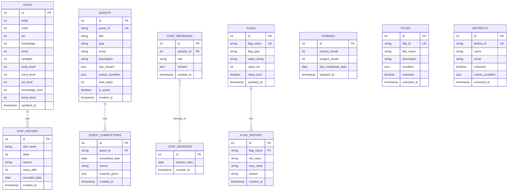

# DB 스키마

## ERD

## 테이블 정의

### stats (단일 행 — 현재 스탯)
| 컬럼 | 타입 | 제약조건 | 설명 |
|------|------|---------|------|
| id | SERIAL | PK | 항상 1 |
| body | INTEGER | DEFAULT 0 | 체(體) 스탯 |
| mind | INTEGER | DEFAULT 0 | 심(心) 스탯 |
| art | INTEGER | DEFAULT 0 | 예(藝) 스탯 |
| knowledge | INTEGER | DEFAULT 0 | 지(知) 스탯 |
| bond | INTEGER | DEFAULT 0 | 연(緣) 스탯 |
| spotlight | INTEGER | DEFAULT 0 | 스포트라이트 게이지 (계산값) |
| body_level | INTEGER | DEFAULT 1 | 체 레벨 |
| mind_level | INTEGER | DEFAULT 1 | 심 레벨 |
| art_level | INTEGER | DEFAULT 1 | 예 레벨 |
| knowledge_level | INTEGER | DEFAULT 1 | 지 레벨 |
| bond_level | INTEGER | DEFAULT 1 | 연 레벨 |
| updated_at | TIMESTAMP | DEFAULT NOW() | 마지막 업데이트 |

### stat_history (스탯 변화 기록)
| 컬럼 | 타입 | 제약조건 | 설명 |
|------|------|---------|------|
| id | SERIAL | PK | |
| stat_name | VARCHAR(20) | NOT NULL | body/mind/art/knowledge/bond |
| delta | INTEGER | NOT NULL | 변화량 (+/-) |
| reason | VARCHAR(50) | NOT NULL | dq-01, mq-02, manual 등 |
| value_after | INTEGER | NOT NULL | 변화 후 값 |
| recorded_date | DATE | NOT NULL | 기록 날짜 |
| created_at | TIMESTAMP | DEFAULT NOW() | |

### quests (퀘스트 정의 — 시드 데이터)
| 컬럼 | 타입 | 제약조건 | 설명 |
|------|------|---------|------|
| id | SERIAL | PK | |
| quest_id | VARCHAR(20) | UNIQUE, NOT NULL | dq-01, mq-01, sq-01 등 |
| title | VARCHAR(100) | NOT NULL | 퀘스트 제목 |
| type | VARCHAR(10) | NOT NULL | daily/main/side/hidden |
| emoji | VARCHAR(10) | | 퀘스트 이모지 |
| description | TEXT | | 상세 설명 |
| stat_reward | JSONB | | {"stat":"body","delta":2} |
| unlock_condition | JSONB | | {"requires":"mq-01","stat_min":{"art":20}} |
| total_steps | INTEGER | DEFAULT 1 | 총 단계 수 |
| is_active | BOOLEAN | DEFAULT true | 활성 여부 |
| created_at | TIMESTAMP | DEFAULT NOW() | |

### quest_completions (퀘스트 완료 기록)
| 컬럼 | 타입 | 제약조건 | 설명 |
|------|------|---------|------|
| id | SERIAL | PK | |
| quest_id | VARCHAR(20) | FK → quests.quest_id | |
| completed_date | DATE | NOT NULL | 완료 날짜 |
| choice | VARCHAR(10) | | 분기 선택 (A/B/C) |
| rewards_given | JSONB | | 실제 지급된 보상 |
| created_at | TIMESTAMP | DEFAULT NOW() | |

### streaks (연속 기록 — 단일 행)
| 컬럼 | 타입 | 제약조건 | 설명 |
|------|------|---------|------|
| id | SERIAL | PK | 항상 1 |
| current_streak | INTEGER | DEFAULT 0 | 현재 연속 일수 |
| longest_streak | INTEGER | DEFAULT 0 | 최장 연속 |
| last_completed_date | DATE | | 마지막 전체 완료 날짜 |
| updated_at | TIMESTAMP | DEFAULT NOW() | |

### flags (분기 플래그)
| 컬럼 | 타입 | 제약조건 | 설명 |
|------|------|---------|------|
| id | SERIAL | PK | |
| flag_name | VARCHAR(50) | UNIQUE, NOT NULL | STORY_first_choice 등 |
| flag_type | VARCHAR(10) | NOT NULL | bool/int/string |
| value_string | VARCHAR(100) | | 문자열 값 |
| value_int | INTEGER | DEFAULT 0 | 수치 값 |
| value_bool | BOOLEAN | DEFAULT false | 불리언 값 |
| updated_at | TIMESTAMP | DEFAULT NOW() | |

### titles (칭호)
| 컬럼 | 타입 | 제약조건 | 설명 |
|------|------|---------|------|
| id | SERIAL | PK | |
| title_id | VARCHAR(30) | UNIQUE, NOT NULL | first_step, dawn_warrior 등 |
| title_name | VARCHAR(50) | NOT NULL | "첫 걸음", "새벽의 전사" |
| description | VARCHAR(200) | | 칭호 설명 |
| condition | JSONB | NOT NULL | {"streak_min":7} |
| unlocked | BOOLEAN | DEFAULT false | |
| unlocked_at | TIMESTAMP | | |

### chat_sessions / chat_messages (별이 대화)
| 컬럼 | 타입 | 제약조건 | 설명 |
|------|------|---------|------|
| sessions.id | SERIAL | PK | |
| sessions.session_date | DATE | UNIQUE | 날짜별 세션 |
| messages.id | SERIAL | PK | |
| messages.session_id | INTEGER | FK | |
| messages.role | VARCHAR(10) | NOT NULL | user/assistant/system |
| messages.content | TEXT | NOT NULL | 메시지 내용 |
| messages.created_at | TIMESTAMP | DEFAULT NOW() | |

### districts (구역)
| 컬럼 | 타입 | 제약조건 | 설명 |
|------|------|---------|------|
| id | SERIAL | PK | |
| district_id | VARCHAR(20) | UNIQUE | dawn_street 등 |
| name | VARCHAR(50) | NOT NULL | 새벽 거리 |
| emoji | VARCHAR(10) | | 🌅 |
| unlocked | BOOLEAN | DEFAULT false | |
| unlock_condition | JSONB | | {"requires":"mq-01"} |
| unlocked_at | TIMESTAMP | | |

## 인덱스 전략

| 테이블 | 인덱스명 | 컬럼 | 용도 |
|--------|---------|------|------|
| stat_history | idx_stat_history_date | recorded_date | 일별 조회 |
| stat_history | idx_stat_history_name | stat_name, recorded_date | 스탯별 히스토리 |
| quest_completions | idx_quest_date | quest_id, completed_date | 오늘 완료 여부 확인 |
| chat_messages | idx_chat_session | session_id, created_at | 세션별 대화 조회 |
| flags | idx_flag_name | flag_name | 플래그 조회 |
